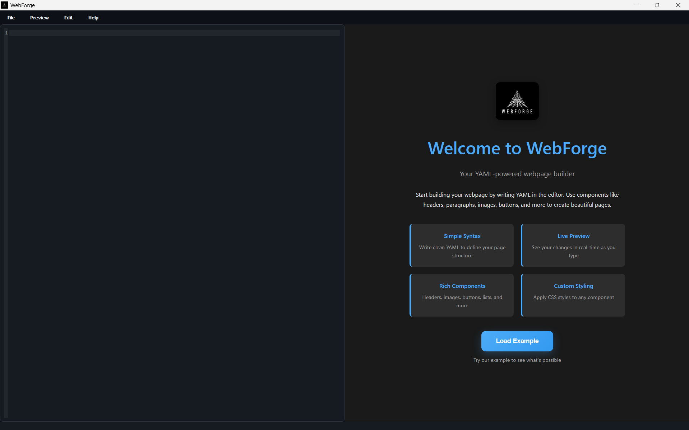
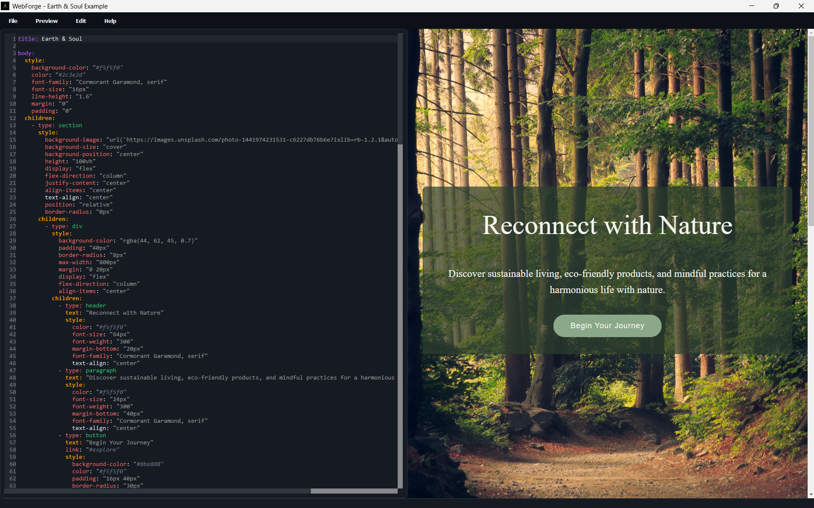

# Overview

A powerful web page builder that converts YAML structures into beautiful HTML pages. Create stunning websites using a simple YAML syntax, making it easy to define layouts, components, and styling in a clean, readable format.

## Screenshots

### Main Application Interface


### Example Output


## Features

- **Simple YAML Syntax**: Define your page structure using easy-to-read YAML
- **Component-Based**: Use pre-built components like sections, headers, paragraphs, images, lists, and buttons
- **Customizable Styling**: Apply CSS styles to any component
- **Live Preview**: See your changes in real-time
- **HTML Source View**: View and copy the generated HTML code while building
- **Browser Preview**: Preview your page in any web browser with a single click
- **Export to HTML**: Save your pages as standalone HTML files
- **Dark Theme**: Modern dark theme interface with consistent styling
- **Syntax Highlighting**: Color-coded YAML editor for better readability
  - Main structure keys (`title`, `body`) in deep purple
  - Secondary keys (`text`, `style`, `children`) in warm orange
  - Component types in mint green
  - CSS properties in coral
  - Values in soft grey
  - Comments in muted blue
  - List items in light grey

## Supported Component Types

The following component types are available for use in your YAML configuration:

1. `header` - For titles and headings
2. `paragraph` - For text content
3. `image` - For displaying images
4. `list` - For creating ordered/unordered lists
5. `button` - For clickable buttons
6. `section` - A container element that can hold other components
7. `div` - A generic container for grouping elements

Each component type supports custom styling and can be nested within other components (except for basic elements like header and paragraph).

## Component Reference

### Header
Creates HTML `<h1>` elements for titles and headings.

**Properties:**
- `type` (required): `"header"`
- `text` (required): The header text content
- `style` (optional): Custom CSS styles

**Default Styling:**
- `color`: `#4dabf7`
- `font-size`: `2.5em`
- `font-weight`: `600`
- `margin`: `0`

**Example:**
```yaml
type: header
text: "Page Title"
style:
  color: "#ffffff"
  font-size: "3rem"
  text-align: "center"
```

### Paragraph
Creates HTML `<p>` elements for text content.

**Properties:**
- `type` (required): `"paragraph"`
- `text` (required): The paragraph text content
- `style` (optional): Custom CSS styles

**Default Styling:**
- `font-size`: `1.1em`
- `color`: `#e0e0e0`

**Example:**
```yaml
type: paragraph
text: "This is a paragraph of text."
style:
  color: "#b0b0b0"
  line-height: "1.8"
  margin: "20px 0"
```

### Image
Creates HTML `` elements with automatic error handling.

**Properties:**
- `type` (required): `"image"`
- `src` (required): Image source path or URL
- `alt` (required): Alternative text for accessibility
- `style` (optional): Custom CSS styles

**Default Styling:**
- `max-width`: `100%`
- `height`: `auto`
- `border-radius`: `8px`
- `box-shadow`: `0 2px 4px rgba(0,0,0,0.3)`

**Example:**
```yaml
type: image
src: "https://example.com/image.jpg"
alt: "Description of the image"
style:
  width: "300px"
  border-radius: "12px"
```

### List
Creates ordered (`<ol>`) or unordered (`<ul>`) lists.

**Properties:**
- `type` (required): `"list"`
- `list-type` (optional): List style type (default: `"none"`)
- `items` (required): Array of list items
- `style` (optional): Custom CSS styles

**List Types:**
- **Numbered**: `decimal`, `decimal-leading-zero`, `lower-roman`, `upper-roman`, `lower-alpha`, `upper-alpha`
- **Bullet Points**: `disc`, `circle`, `square`, `none`

**Default Styling:**
- `list-style-type`: Based on `list-type` property
- `margin`: `0`
- `padding`: `0`

**Example:**
```yaml
type: list
list-type: "decimal"
items:
  - "First item"
  - "Second item"
  - "Third item"
style:
  color: "#e0e0e0"
  margin: "20px 0"
```

### Button
Creates clickable buttons with variant support.

**Properties:**
- `type` (required): `"button"`
- `text` (required): Button text content
- `link` (optional): Destination URL (default: `"#"`)
- `variant` (optional): Button color variant (default: `"primary"`)
- `size` (optional): Button size (default: `"medium"`)
- `button-style` (optional): Button style (default: `"solid"`)
- `style` (optional): Custom CSS styles

**Variants:** `primary`, `secondary`, `success`, `danger`, `warning`, `info`, `light`, `dark`
**Sizes:** `small`, `medium`, `large`
**Styles:** `solid`, `outline`, `ghost`

**Default Styling:**
- `border`: `none`
- `border-radius`: `8px`
- `font-weight`: `500`
- `cursor`: `pointer`
- `transition`: `all 0.2s ease`
- `text-decoration`: `none`
- `display`: `inline-block`
- `text-align`: `center`

**Example:**
```yaml
type: button
text: "Click Me"
link: "/destination"
variant: "success"
size: "large"
button-style: "outline"
style:
  border-radius: "20px"
```

### Section
Container element that can hold text and other components.

**Properties:**
- `type` (required): `"section"`
- `text` (optional): Section text content
- `children` (optional): Array of child components
- `style` (optional): Custom CSS styles

**Default Styling:**
- `background`: `#2d2d2d`
- `border-radius`: `12px`
- `box-shadow`: `0 2px 8px rgba(0,0,0,0.2)`
- `padding`: `1em`

**Example:**
```yaml
type: section
text: "Section content"
style:
  padding: "2em"
  margin: "2em 0"
children:
  - type: header
    text: "Section Title"
  - type: paragraph
    text: "Section description"
```

### Div
Generic container for grouping elements.

**Properties:**
- `type` (required): `"div"`
- `text` (optional): Div text content
- `children` (optional): Array of child components
- `style` (optional): Custom CSS styles

**Default Styling:**
- No default styling (inherits from parent)

**Example:**
```yaml
type: div
text: "Div content"
style:
  background-color: "#363636"
  padding: "1.5em"
  border-radius: "8px"
children:
  - type: paragraph
    text: "Content inside div"
```

## Page Structure

### Body
The main container for all page content.

**Properties:**
- `text` (optional): Body text content
- `children` (optional): Array of child components
- `style` (optional): Custom CSS styles

**Default Styling:**
- `margin`: `0`
- `padding`: `0`
- `font-family`: `'Segoe UI', system-ui, -apple-system, sans-serif`
- `background-color`: `#1a1a1a`
- `color`: `#e0e0e0`
- `line-height`: `1.6`

**Example:**
```yaml
title: "My Page"

body:
  text: "Welcome to my page!"
  style:
    background-color: "#f0f0f0"
    color: "#333333"
    padding: "20px"
  children:
    - type: header
      text: "Page Title"
    - type: paragraph
      text: "Page content goes here"
```

### Title
Sets the HTML page title (appears in browser tab).

**Properties:**
- `title` (required): The page title

**Example:**
```yaml
title: "My Awesome Website"
```

## Syntax Highlighting

The YAML editor features color-coded syntax highlighting to make your code more readable:

- **Deep Purple** (`#9d4edd`): Main structure keys (`title`, `body`)
- **Warm Orange** (`#ff9e00`): Secondary keys (`text`, `style`, `children`)
- **Mint Green** (`#2ecc71`): Component types (section, header, paragraph, etc.)
- **Coral** (`#ff6b6b`): CSS properties and type declarations
- **Soft Grey** (`#a0a0a0`): String values and numbers
- **Muted Blue** (`#6c7a89`): Comments
- **Light Grey** (`#bdc3c7`): List items

## Complete Example

```yaml
title: Earth & Soul

body:
  style:
    background-color: "#f5f5f0"
    color: "#2c3e2d"
    font-family: "Cormorant Garamond, serif"
    font-size: "16px"
    line-height: "1.6"
    margin: "0"
    padding: "0"
  children:
    - type: section
      style:
        background-image: "url('https://images.unsplash.com/photo-1441974231531-c6227db76b6e?ixlib=rb-1.2.1&auto=format&fit=crop&w=1950&q=80')"
        background-size: "cover"
        background-position: "center"
        height: "100vh"
        display: "flex"
        flex-direction: "column"
        justify-content: "center"
        align-items: "center"
        text-align: "center"
        position: "relative"
        border-radius: "0px"
      children:
        - type: div
          style:
            background-color: "rgba(44, 62, 45, 0.7)"
            padding: "40px"
            border-radius: "8px"
            max-width: "800px"
            margin: "0 20px"
            display: "flex"
            flex-direction: "column"
            align-items: "center"
          children:
            - type: header
              text: "Reconnect with Nature"
              style:
                color: "#f5f5f0"
                font-size: "64px"
                font-weight: "300"
                margin-bottom: "20px"
                font-family: "Cormorant Garamond, serif"
                text-align: "center"
            - type: paragraph
              text: "Discover sustainable living, eco-friendly products, and mindful practices for a harmonious life with nature."
              style:
                color: "#f5f5f0"
                font-size: "24px"
                font-weight: "300"
                margin-bottom: "40px"
                font-family: "Cormorant Garamond, serif"
                text-align: "center"
            - type: button
              text: "Begin Your Journey"
              link: "#explore"
              style:
                background-color: "#8ba888"
                color: "#f5f5f0"
                padding: "16px 40px"
                border-radius: "30px"
                font-weight: "500"
                font-size: "18px"
                border: "none"
                cursor: "pointer"
                transition: "all 0.3s"
                font-family: "Montserrat, sans-serif"
                letter-spacing: "1px"
                text-align: "center"

    - type: section
      style:
        padding: "40px 20px"
        background-color: "#f5f5f0"
      children:
        - type: header
          text: "Latest from Our Blog"
          style:
            color: "#2c3e2d"
            font-size: "42px"
            font-weight: "300"
            margin-bottom: "60px"
            text-align: "center"
            font-family: "Cormorant Garamond, serif"
        - type: div
          style:
            display: "grid"
            grid-template-columns: "repeat(auto-fit, minmax(300px, 1fr))"
            gap: "40px"
            max-width: "1200px"
            margin: "0 auto"
          children:
            - type: div
              style:
                background-color: "#ffffff"
                border-radius: "12px"
                overflow: "hidden"
                box-shadow: "0 4px 20px rgba(44, 62, 45, 0.1)"
              children:
                - type: image
                  src: "https://images.unsplash.com/photo-1502086223501-7ea6ecd79368?ixlib=rb-1.2.1&auto=format&fit=crop&w=800&q=80"
                  alt: "Sustainable Living"
                  style:
                    width: "100%"
                    height: "250px"
                    object-fit: "cover"
                - type: div
                  style:
                    padding: "30px"
                  children:
                    - type: header
                      text: "Mindful Living in the Digital Age"
                      style:
                        color: "#2c3e2d"
                        font-size: "24px"
                        font-weight: "500"
                        margin-bottom: "15px"
                        font-family: "Montserrat, sans-serif"
                    - type: paragraph
                      text: "Finding balance between technology and nature in our modern world."
                      style:
                        color: "#5c6c5c"
                        font-size: "16px"
                        line-height: "1.6"
                        font-family: "Montserrat, sans-serif"
            - type: div
              style:
                background-color: "#ffffff"
                border-radius: "12px"
                overflow: "hidden"
                box-shadow: "0 4px 20px rgba(44, 62, 45, 0.1)"
              children:
                - type: image
                  src: "https://images.unsplash.com/photo-1518495973542-4542c06a5843?ixlib=rb-1.2.1&auto=format&fit=crop&w=800&q=80"
                  alt: "Eco Products"
                  style:
                    width: "100%"
                    height: "250px"
                    object-fit: "cover"
                - type: div
                  style:
                    padding: "30px"
                  children:
                    - type: header
                      text: "Eco-Friendly Home Essentials"
                      style:
                        color: "#2c3e2d"
                        font-size: "24px"
                        font-weight: "500"
                        margin-bottom: "15px"
                        font-family: "Montserrat, sans-serif"
                    - type: paragraph
                      text: "Transform your living space with sustainable and natural products."
                      style:
                        color: "#5c6c5c"
                        font-size: "16px"
                        line-height: "1.6"
                        font-family: "Montserrat, sans-serif"
            - type: div
              style:
                background-color: "#ffffff"
                border-radius: "12px"
                overflow: "hidden"
                box-shadow: "0 4px 20px rgba(44, 62, 45, 0.1)"
              children:
                - type: image
                  src: "https://images.unsplash.com/photo-1470252649378-9c29740c9fa8?ixlib=rb-1.2.1&auto=format&fit=crop&w=800&q=80"
                  alt: "Nature Connection"
                  style:
                    width: "100%"
                    height: "250px"
                    object-fit: "cover"
                - type: div
                  style:
                    padding: "30px"
                  children:
                    - type: header
                      text: "The Healing Power of Nature"
                      style:
                        color: "#2c3e2d"
                        font-size: "24px"
                        font-weight: "500"
                        margin-bottom: "15px"
                        font-family: "Montserrat, sans-serif"
                    - type: paragraph
                      text: "Exploring the profound impact of nature on our mental and physical wellbeing."
                      style:
                        color: "#5c6c5c"
                        font-size: "16px"
                        line-height: "1.6"
                        font-family: "Montserrat, sans-serif"

    - type: section
      style:
        background-color: "#8ba888"
        padding: "80px 20px"
        text-align: "center"
      children:
        - type: header
          text: "Join Our Community"
          style:
            color: "#f5f5f0"
            font-size: "42px"
            font-weight: "300"
            margin-bottom: "20px"
            font-family: "Cormorant Garamond, serif"
        - type: paragraph
          text: "Subscribe to our newsletter for mindful living tips, sustainable product updates, and exclusive content."
          style:
            color: "#f5f5f0"
            font-size: "18px"
            margin-bottom: "40px"
            max-width: "600px"
            margin-left: "auto"
            margin-right: "auto"
            font-family: "Montserrat, sans-serif"
        - type: div
          style:
            max-width: "500px"
            margin: "0 auto"
            display: "flex"
            gap: "10px"
            justify-content: "center"
          children:
            - type: input
              type: "email"
              placeholder: "Enter your email"
              style:
                width: "60%"
                padding: "15px 20px"
                border: "none"
                border-radius: "30px"
                font-size: "16px"
                font-family: "Montserrat, sans-serif"
            - type: button
              text: "Subscribe"
              style:
                background-color: "#2c3e2d"
                color: "#f5f5f0"
                padding: "15px 30px"
                border-radius: "30px"
                font-weight: "500"
                font-size: "16px"
                border: "none"
                cursor: "pointer"
                transition: "all 0.3s"
                font-family: "Montserrat, sans-serif"
                white-space: "nowrap"
```

## Usage

1. **Installation**:
   ```bash
   pip install -r requirements.txt
   ```

2. **Running the Application**:
   ```bash
   python main.py
   ```

3. **Creating a Page**:
   - Use the YAML editor to write your page structure
   - See live preview updates as you type
   - Use syntax highlighting to ensure correct structure
   - Export to HTML when ready

4. **Tips**:
   - Use the syntax highlighting as a guide for correct YAML structure
   - Preview changes in real-time to see how they affect the layout
   - Use the component examples as templates for your own components
   - Export your pages to share or deploy them

## Requirements

- Python 3.8 or higher
- PyQt6
- PyYAML
- Pillow (PIL)

## License

This project is licensed under the MIT License - see the LICENSE file for details.

## Default Values

### Base Elements
- `body`
  - `margin`: 0
  - `padding`: 0
  - `font-family`: 'Segoe UI', system-ui, -apple-system, sans-serif
  - `background-color`: #1a1a1a
  - `color`: #e0e0e0
  - `line-height`: 1.6

### Typography
- `h1`
  - `color`: #4dabf7
  - `font-size`: 2.5em
  - `font-weight`: 600

- `p`
  - `font-size`: 1.1em
  - `color`: #e0e0e0

### Images
- `img`
  - `max-width`: 100%
  - `height`: auto
  - `border-radius`: 8px
  - `box-shadow`: 0 2px 4px rgba(0,0,0,0.3)

### Containers
- `section`
  - `background`: #2d2d2d
  - `border-radius`: 12px
  - `box-shadow`: 0 2px 8px rgba(0,0,0,0.2)

- `.image-container`
  - `background`: #2d2d2d
  - `border-radius`: 12px
  - `box-shadow`: 0 2px 8px rgba(0,0,0,0.2)

### Lists
- `ul`
  - `list-style-type`: none

- `li`
  - `background`: #2d2d2d
  - `border-radius`: 8px
  - `color`: #e0e0e0

### Buttons
- `.buttons`
  - `display`: flex
  - `gap`: 1em

- `.buttons button`
  - `border`: none
  - `border-radius`: 8px
  - `background`: #4dabf7
  - `color`: white
  - `font-size`: 1em
  - `cursor`: pointer
  - `transition`: background-color 0.2s

### Text Classes
- `.body-text`
  - `color`: #e0e0e0
  - `font-size`: 1.1em

- `.section-text`
  - `color`: #e0e0e0
  - `font-size`: 1.1em

- `.div-text`
  - `color`: #e0e0e0
  - `font-size`: 1.1em

## Usage

All these default values can be overridden in your YAML configuration. The converter will apply your custom styles while maintaining any unspecified properties with their default values.

Example:
```yaml
title: My Page
body:
  style:
    background-color: "#ffffff"
    color: "#000000"
  children:
    - type: header
      text: "My Header"
      style:
        color: "#333333"
        font-size: "48px"
```

## Component Properties Summary

| Component | Required Properties | Optional Properties | Default Values |
|-----------|-------------------|-------------------|----------------|
| **title** | `title` | - | - |
| **body** | - | `text`, `children`, `style` | See Body defaults |
| **header** | `type`, `text` | `style` | `color: #4dabf7`, `font-size: 2.5em`, `font-weight: 600`, `margin: 0` |
| **paragraph** | `type`, `text` | `style` | `font-size: 1.1em`, `color: #e0e0e0` |
| **image** | `type`, `src`, `alt` | `style` | `max-width: 100%`, `height: auto`, `border-radius: 8px`, `box-shadow: 0 2px 4px rgba(0,0,0,0.3)` |
| **list** | `type`, `items` | `list-type`, `style` | `list-type: "none"`, `margin: 0`, `padding: 0` |
| **button** | `type`, `text` | `link`, `variant`, `size`, `button-style`, `style` | `link: "#"`, `variant: "primary"`, `size: "medium"`, `button-style: "solid"` |
| **section** | `type` | `text`, `children`, `style` | `background: #2d2d2d`, `border-radius: 12px`, `box-shadow: 0 2px 8px rgba(0,0,0,0.2)`, `padding: 1em` |
| **div** | `type` | `text`, `children`, `style` | No default styling |

## Button Variants Reference

| Variant | Solid Color | Outline Color | Ghost Color |
|---------|-------------|---------------|-------------|
| **primary** | `#4dabf7` | `#4dabf7` | `rgba(77, 171, 247, 0.1)` |
| **secondary** | `#6c757d` | `#6c757d` | `rgba(108, 117, 125, 0.1)` |
| **success** | `#28a745` | `#28a745` | `rgba(40, 167, 69, 0.1)` |
| **danger** | `#dc3545` | `#dc3545` | `rgba(220, 53, 69, 0.1)` |
| **warning** | `#ffc107` | `#ffc107` | `rgba(255, 193, 7, 0.1)` |
| **info** | `#17a2b8` | `#17a2b8` | `rgba(23, 162, 184, 0.1)` |
| **light** | `#f8f9fa` | `#f8f9fa` | `rgba(248, 249, 250, 0.1)` |
| **dark** | `#343a40` | `#343a40` | `rgba(52, 58, 64, 0.1)` |

## Button Sizes Reference

| Size | Padding | Font Size |
|------|---------|-----------|
| **small** | `6px 12px` | `0.875rem` |
| **medium** | `10px 20px` | `1rem` |
| **large** | `14px 28px` | `1.125rem` |

## List Types Reference

| Type | Description | Example |
|------|-------------|---------|
| **decimal** | Regular numbers | 1, 2, 3, 4 |
| **decimal-leading-zero** | Numbers with leading zeros | 01, 02, 03, 04 |
| **lower-roman** | Lowercase Roman numerals | i, ii, iii, iv |
| **upper-roman** | Uppercase Roman numerals | I, II, III, IV |
| **lower-alpha** | Lowercase letters | a, b, c, d |
| **upper-alpha** | Uppercase letters | A, B, C, D |
| **disc** | Filled circle bullets | • |
| **circle** | Hollow circle bullets | ○ |
| **square** | Square bullets | ■ |
| **none** | No bullets or numbers | |

## Notes
- All positioning-related properties (margin, padding) have been removed from defaults to prevent layout conflicts
- Colors can be specified in hex format (`#ff0000`), named colors (`red`), or other CSS color formats - hex format is preferred for consistency
- Font sizes can be specified in any valid CSS unit (px, em, rem, etc.)
- Custom styles in YAML will override these defaults
- Button variants use `!important` to ensure they override any conflicting CSS
- All components support nesting except basic elements (header, paragraph) 